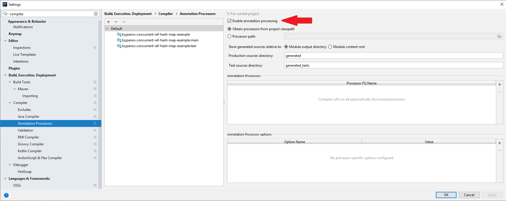

Пример для статьи https://habr.com/post/432824/

ВАЖНО!

Перед запуском из "Идеи" необходимо включить обработку аннотаций:

- открываем настройки (Ctrl+Alt+S)
- переходим в Build, Execution, Deployment
- оттдуда в подраздел Compiler
- включаем галочку Enable annotation processing

